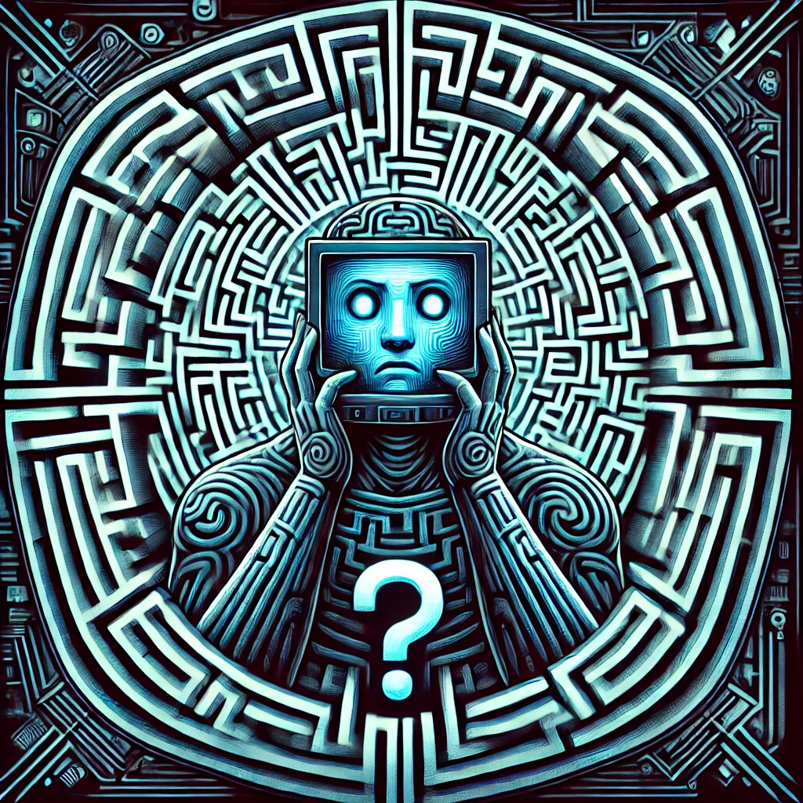

# EternalEscape

## Main Project Repo for the EternalEscape desktop toy!
**EternalEscape** is a desktop toy that generates and solves random mazes for endless entertainment and distraction from any productivity! 
Designed to be both entertaining and mesmerizing, it’s the perfect addition to your workspace. 
The project is fully open-source and can be built using common materials and components from Adafruit.

---

## Features

- **Random Maze Generation:** Creates unique mazes endlessly using Prim's Algorithm.  
- **Real-Time Maze Solving:** Watch as the algorithm finds its way out, again and again.
- **Race Mode:** Watch two algorithms race each other in the maze. 
- **Compact Design:** Fully 3D printable with common hardware components.  
- **Customization:** Features a GUI to customize various settings of the device.

---

## Hardware Requirements

- **3D Printed Parts:** Designed for an Ender3 printer. CAD files are in Inventor format, with STLs provided.  
- **Fasteners:** (items marked with '[!]' are optional, and could be replaced with hot glue.)
  - 2 × M3x5mm bolts  [!]
  - 4 × M3x8mm bolts  
  - 4 × M2x3mm bolts  [!]
- **Electronics:**
  - Adafruit Feather ESP32-S3 (2MB PSRAM)  
  - Adafruit 2.8" ILI9341 TFT Resistive Touch Display
  - Female-to-female jumpers or wire.
      - For wire, I recommend Adafruit 22AWG Solid Core wire. (It comes in a nice box) 

---

## Software Requirements

- All source code is written in **C++**!
- **Compiler:** Upload code to the controller using PlatformIO for VSCode.
  - You can also use your preferred compiler, but this project is made for PlatformIO. 

---

## Assembly

Assembly of this project is straightforward, and a full guide can be found in EternalEscape/Assembly.md
1. **Print the Parts:** Use the provided STL files to 3D print all necessary components.
2. **Connect Electronics:** Follow the wiring diagram in EternalEscape/Hardware/ to connect the display to the ESP32-S3.
3. **Upload the Code:** Flash the provided C++ code in EternalEscape/Software/ to the ESP32-S3 using PlatformIO for VScode
4. **Put it Together:** Secure the parts using the listed bolts or hot glue.

---

## Future Roadmap

- **Networking:** Idk What I'd do with this, but it's something I'm thinking about.
- **Fight-Mode:** A snake-style fight mode.
- **Smooth Traversal:** Add animations to smooth player traversal from location to location.

---

## Contributing

Contributions are welcome! Feel free to submit issues or pull requests to help make EternalEscape even better.

---

## License

See `LICENSE` for details.
